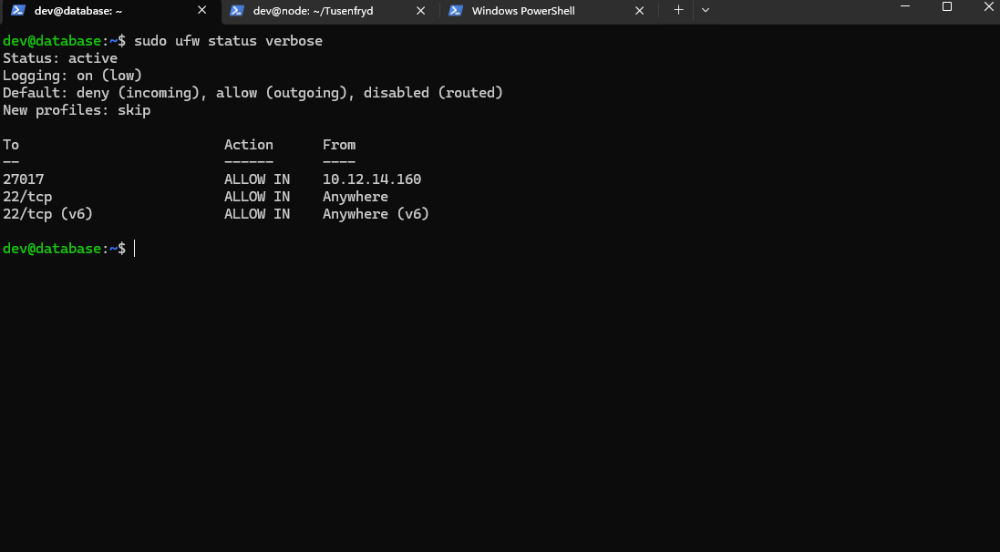
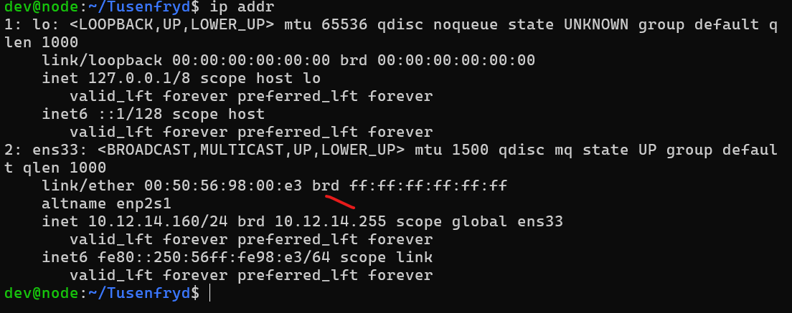
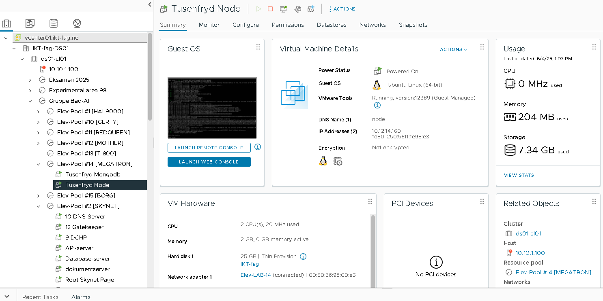

# Tusenfryd Nettapplikasjon – Teknisk Dokumentasjon

## Innhold
- [Oversikt](#oversikt)
- [Datamodell](#datamodell)
- [API-endepunkter](#api-endepunkter)
- [Struktur](#struktur)
- [Eksempel på API-respons](#eksempel-på-api-respons)
- [Kort rapport](#kort-rapport)

---

## Oversikt
Tusenfryd skal modernisere infrastrukturen og brukersystemet for både ansatte og gjester.
Du er leid inn som utvikler og driftstekniker og skal utvikle en nettbasert applikasjon samt
sette opp nettverksinfrastruktur og drift, med sikker tilgangskontroll og dokumentasjon.

**Hovedfunksjoner:**
- Se og søke etter attraksjoner
- Reservasjonssystem med kølogikk
- Adminpanel for CRUD på attraksjoner, endre åpningstider, se reservasjoner
- System for varsling når attraksjoner er stengt
- (Bonus) Intern chat for ansatte

---

## Datamodell

### Attraction
```json
{
  "_id": "ObjectId",
  "name": "Thundercoaster",
  "description": "En heftig berg-og-dal-bane...",
  "openingTime": "10:00",
  "closingTime": "18:00",
  "waitTime": 15,
  "isOpen": true,
  "queueCapacity": 20,
  "queue": ["user1", "user2"]
}
```

### User
```json
{
  "_id": "ObjectId",
  "username": "admin",
  "password": "<hashed>",
  "role": "admin" // eller "user"
}
```

### Reservation
```json
{
  "_id": "ObjectId",
  "attraction": "ObjectId",
  "user": "brukernavn",
  "reservationTime": "2025-06-03T10:00:00.000Z"
}
```

---

## API-endepunkter

Alle API-endepunkter følger REST-prinsipper og returnerer JSON.

### Attraksjoner
- **GET /api/attractions**
  - Hent alle attraksjoner
- **GET /api/attractions/:id**
  - Hent én attraksjon
- **POST /api/attractions** *(krever innlogging)*
  - Opprett ny attraksjon
  - Body: `{ "name": "string", "description": "string", ... }`
- **PUT /api/attractions/:id** *(krever innlogging)*
  - Oppdater attraksjon
- **DELETE /api/attractions/:id** *(krever innlogging)*
  - Slett attraksjon

### Autentisering
- **POST /api/auth/login**
  - Logg inn bruker/admin
  - Body: `{ "username": "string", "password": "string" }`
- **POST /api/auth/logout**
  - Logg ut

### Reservasjon
- **POST /reserve/:id**
  - Reserver plass i kø for attraksjon (må være innlogget)

---

## Struktur

```
Tusenfryd/
├── index.js
├── config/
│   └── databse.js
├── controllers/
│   └── pageController.js
├── handlers/
│   ├── attractionHandler.js
│   └── authHandler.js
├── middleware/
│   ├── errorHandler.js
│   └── notFoundHandler.js
├── models/
│   ├── Attraction.js
│   ├── Reservation.js
│   ├── User.js
│   └── AdminMessage.js
├── routes/
│   ├── attractionRoutes.js
│   ├── authRoutes.js
│   └── pageRoutes.js
├── utils/
│   └── isAdmin.js
├── views/
│   ├── partials/
│   └── ...
├── public/
│   └── ...
└── seed.js
```

---

## Eksempel på API-respons

**GET /api/attractions**
```json
[
  {
    "_id": "665d1f...",
    "name": "Thundercoaster",
    "description": "En heftig berg-og-dal-bane...",
    "openingTime": "10:00",
    "closingTime": "18:00",
    "waitTime": 15,
    "isOpen": true,
    "queueCapacity": 20,
    "queue": ["user1", "user2"]
  },
  ...
]
```

**POST /api/auth/login**
```json
{
  "success": true,
  "message": "Innlogging vellykket"
}
```

**POST /api/attractions**
```json
{
  "_id": "665d1f...",
  "name": "SpinSpider",
  "description": "En gigantisk pendel...",
  ...
}
```

---

# Kort rapport

## Feilsøkingsstrategier og refleksjoner

Under utviklingen av Tusenfryd-applikasjonen har følgende feilsøkingsstrategier vært sentrale:

- **Konsoll- og serverlogging:** Ved feil i backend har vi brukt `console.error` og feilmeldinger i terminalen for å identifisere hvor i koden feilen oppstår. Egen feilhåndterings-middleware (`middleware/errorHandler.js` og `middleware/notFoundHandler.js`) sørger for at brukeren får tydelige feilmeldinger, samtidig som detaljer logges for utvikler.
- **Flash-meldinger:** Systemet bruker flash-meldinger for å vise brukervennlige feilmeldinger i frontend, slik at brukeren får tilbakemelding uten å se tekniske detaljer.
- **Testing i flere steg:** Nye funksjoner er testet først med Postman (for API-endepunkter) og deretter i nettleser for å sikre at både API og brukergrensesnitt fungerer som forventet.
- **Datavalidering:** Det er lagt inn validering av input, for eksempel tidspunkter i formatet HH:MM, for å unngå feil i databasen.
- **Refleksjon:** En viktig lærdom har vært å holde backend og frontend tydelig adskilt, og å bruke modeller og ruter konsekvent. Det har også vært nyttig å bruke EJS-partials for å gjenbruke kode i visningene.

## Funksjonelle krav og hvordan de er løst

**1. Se og søke etter attraksjoner**
- Løst med en egen side (`/attractions`) som viser alle attraksjoner fra databasen. Søkefeltet filtrerer attraksjoner basert på navn.

**2. Reservasjonssystem med kølogikk**
- Brukere kan reservere plass i kø for en attraksjon. Systemet sjekker kapasitet og om brukeren allerede står i kø. Reservasjoner lagres i en egen modell (`Reservation`).

**3. Adminpanel for CRUD på attraksjoner**
- Administratorer har tilgang til et adminpanel hvor de kan opprette, redigere og slette attraksjoner. Endringer oppdateres direkte i databasen.

**4. Endre åpningstider, ventetid og status**
- Admin kan endre åpningstid, ventetid og status (åpen/stengt) for hver attraksjon via adminpanelet.

**5. System for varsling når attraksjoner er stengt**
- Når en attraksjon er stengt, vises dette tydelig med badge og flash-melding til brukerne.

**6. (Bonus) Intern chat for ansatte**
- Det er implementert et enkelt chat- og varslingssystem for ansatte/admin i adminpanelet.

**7. Bildevisning for attraksjoner**
- Hver attraksjon kan vise et bilde, som hentes fra `public/images`-mappen. Bildet vises både i liste og på detaljside.

Alle krav er løst med tydelig separasjon mellom backend (API, datamodeller, autentisering) og frontend (EJS-visninger, Bootstrap for design). Systemet er utvidbart og lett å feilsøke videre.

---

## Nettverksoppsett og sikkerhet

### UFW-status (Uncomplicated Firewall)




### IP-adresse (ip a)




### VSPhere

Dette bildet viser nettverksgrensesnitt og IP-adresse på den virtuelle maskinen:




